# Horizontal Scaling with Configurable Raft Replica Sets

Status: design draft for the active [horizontal scaling epic](horizontal-scaling-epic.md),
tracked against [issue #2](https://github.com/tonbo-io/ursula/issues/2).
Code review baseline: upstream `main` at
`c066d14823fc90dfa6c50e0f3d7d9e4af5c33466` (2026-10-06).
This document specifies follow-up work; it does not claim an implemented or
tested scaling workflow. The existing [dynamic membership foundation](dynamic-group-membership.md)
remains the starting point.

## Capacity model and first release boundary

Keep stream-to-group assignment stable and move whole Raft group replicas
between nodes. Each group keeps its configured replication factor (RF), default
three and initially supporting three or five, regardless of the number of data
nodes. Balance both replicas and
leaders: moving only leaders leaves every node storing and applying every
group's writes; adding every new node as a voter increases replication work.

For example, 256 groups with three voters have 768 replica placements. On
three balanced nodes each node hosts 256 groups. On six balanced nodes each
hosts 128, with about 42 or 43 leaders. This is an ideal distribution, not a
throughput prediction. Group skew, leader work, network, snapshots, and cold
storage can limit the gain. Moving from the former layout to the latter
requires 384 replacement-replica placements, potentially substantial transfer
work even though the final replica count is unchanged.

RF=5 has 1,280 replica placements for the same 256 groups. On five balanced
nodes each hosts 256 groups; on ten each hosts 128. The RF=3 example above is
one policy, not a hard-coded limit or the topology used for RF=5 acceptance.

For balanced logical state of size D, average replicated state per node is
approximately `D * replication_factor / node_count`. With RF=3, payload
replication still sends two copies per append outside transient migration;
scale-out does not eliminate cross-AZ transfer cost. Provision memory and disk
for the extra learner, snapshot installation, and leader-failure headroom.

The first release supports manual node registration, group moves, rebalance
plans, and node evacuation, executed by a recoverable server-side controller.
It keeps `raft.group_count`, routing hash, and the deployment's core-count
contract fixed. It does not split streams, split/merge groups, or provision
machines. One hot stream still has one ordered Raft write path. A later
persisted virtual-bucket/range map can redistribute independent streams from
a hot group; it cannot parallelize one stream's ordered appends.

## Replication policy

In managed scaling mode, use a cluster default RF with optional per-group
overrides. Initially accept RF=3 and RF=5; other values are rejected rather than
silently rounded or clamped. Existing static and single-node development modes
keep their existing explicit membership semantics.

The placement section below is accepted by opt-in managed configuration as of
`73f6970`; a complete `[control]` directory/bootstrap configuration is also
required. This section alone does not enable a migration executor:

```toml
[control.placement]
default_replication_factor = 3
failure_domain = "zone"
survive_failure_domains = 1

[[control.placement.group_overrides]]
raft_group_id = 42
replication_factor = 5
```

Local epic implementation checkpoint (`5c7e413`): the deterministic
`ursula-control` policy layer now accepts this placement structure, validates
RF3/RF5 and one-domain-loss constraints, and persists cluster bootstrap plus
resolved per-group policies through meta snapshots/logs. Adoption validates
all recorded uniform placements atomically and rejects RF/bootstrap drift.
Ordinary migration intents preserve RF; explicit policy intents retain both
source and target policy. The server's `[control]` configuration, actual
membership discovery, multi-node transport and supported migration executor
are still subsequent stories; editing server TOML does not yet enable scaling.

Transport checkpoint (`a5af881`): meta append/vote/snapshot/leader-transfer
RPCs now use a separate service with cluster-token, recipient and protocol
checks. Real TCP tests cover three/five durable meta voters, leader handoff,
one/two unavailable voters, snapshot installation into an empty learner, and
full replica shutdown/reopen. Persisted identity, production bootstrap and
server routing remain in HS-103; these tests do not establish a supported
data-group migration or CLI scaling workflow.

Persist the default and each group's resolved policy in meta Raft. Configuration
seeds policy only on initial bootstrap; editing TOML after bootstrap must not
silently change live memberships. API/CLI policy updates are explicit, durable
operations. During static-to-managed adoption, infer and validate the existing
voter counts; reject configurations that imply an unrequested RF change.

Use `quorum = floor(RF / 2) + 1` throughout planning, readiness, maintenance,
and tests. RF=3 needs two votes and tolerates one voter failure; RF=5 needs
three and tolerates two. These are voter-failure properties, not evidence of
durability under arbitrary correlated storage or AZ failures. RF=5 also has
more replication traffic, apply work, state, and potentially quorum latency.

Failure-domain constraints are a separate policy. To keep a majority after loss
of any one AZ, each AZ may hold at most `RF - quorum` voters: one for RF=3 and
two for RF=5. Five voters can therefore use three AZs as `2/2/1`; `3/1/1` fails
that policy despite having three AZ labels. Validate old/new configurations
through joint consensus, not only the final distribution. For now the supported
failure-domain policy is loss of one domain; stronger policies require separate
placement and acceptance criteria.

Ordinary rebalance preserves each group's resolved target RF. Learners and
joint-consensus voter unions may temporarily increase the number of replicas;
they do not change the steady-state target. Never reduce RF to make a scale-in
plan fit. Reject insufficient node count, domain diversity, or capacity.

Changing a group's RF is a separate policy-migration operation. Increasing
3 to 5 adds and catches up destinations before changing voters; decreasing
5 to 3 checks the explicitly requested weaker policy before removing voters.
Persist source/target RF alongside source/target voter sets, fence and reconcile
each transition, then publish the target policy with verified placement. A
cluster-default update must explicitly state its affected groups; no background
reinterpretation of existing policy is allowed. Stage a large replacement or
RF change into verified membership steps using the same durable operation,
with an authorized intermediate target and log identity for each step.

Meta Raft has an independently configured voter set, initially three. Selecting
RF=5 for data groups does not automatically change meta membership; operators
requiring two-failure control-plane availability must also provision and
explicitly configure five meta voters.

## What exists and what is missing

The table below records the upstream review at `c066d148`. Later implementation
checkpoints in this document and the epic scoreboard track completed components;
the table is not a claim about the current epic branch.

| Area | Reviewed implementation | Required follow-up |
| --- | --- | --- |
| Stream routing | `StaticShardMap`: hash modulo group count, group modulo core count | Persist routing identity; reject incompatible joins and online group-count changes |
| Static replica subsets | `raft.groups`, factory ownership checks, `GroupNotHosted` | Dynamic host assignments and recoverable prepare/release |
| Raft membership | Raw add-learner and change-voter admin routes; peer address comes from `BasicNode` | Supported migration operations, reconciliation, fencing, and verification |
| Control state | `ursula-control`: nodes, placements, phases, one global active migration | Bind transitions to intent/version/evidence; idempotency; bounded history |
| Meta Raft | Type config, state machine, in-memory log and snapshots; injectable network factory | Durable vote/log/snapshot recovery, concrete multi-node transport, bootstrap and projection distribution |
| Client routing | Static node peers and per-group voters; gateway static upstream allowlist and leader cache | Live node directory, placement projection, and cache invalidation |
| Maintenance | Node expectations derive from static topology; current quorum verifier expects every voter to host every group | Per-group membership and assigned-node inventory, including joint configurations |
| Snapshot retention | Expected voters configured statically; current-reference and transfer pins exist | Membership-aware protection and explicit retirement of old references |

`allow_dynamic_group_hosting` is currently exercised only by a test. Allowing
a group in that in-memory set alone neither creates its engine nor preserves
the assignment across a restart. Likewise, `EvictLearner` changes control
metadata; it does not remove an OpenRaft learner or stop a local replica.

## Ownership and control-plane topology

```text
stream identity -> fixed group id -> cached placement and leader hint
                                      -> node -> owning core -> data Raft

operator -> admin API -> durable meta Raft intent
                         -> migration reconciler -> local replica lifecycle
                                                 -> data Raft membership
                         -> placement projections -> nodes and gateways
```

Use one small meta Raft group, initially three explicitly configured voters,
which may share machines with data nodes. Adding data capacity does not add
meta voters. Removing a machine that is also a meta voter requires a separate
meta-membership workflow first, or the operation must be rejected.

Meta Raft is authoritative for node identity, immutable routing configuration,
placement policy, migration intent, operation identity, and published placement.
Each data group's committed OpenRaft membership is authoritative for its
actual voter/learner set. The meta projection must follow that fact; publishing
placement does not grant a node Raft authority. Leader hints are ephemeral,
not meta writes on every election. Ordinary stream requests do not read or
write meta Raft synchronously.

On meta-quorum loss, freeze new placement changes and controller side effects.
Established data groups continue serving through cached projections and their
own quorum checks. An already submitted data-membership change can still
complete; recovery must discover it. A joining node without an authenticated,
validated assignment cannot initialize data groups from defaults.

Bootstrap explicitly once: create the durable meta group, register the existing
node inventory, validate each data group's actual committed membership, then
seed placements. Reject disagreement rather than overwrite live membership
from TOML. Static config remains authoritative in static mode; in dynamic mode
it supplies identity, storage, and bootstrap/discovery endpoints. Restart
recovers persisted membership and assignments, never re-seeds old placement.
Keep dynamic mode opt-in so static deployments retain their current semantics.

For the first supported scaling workflow require persistent data WAL and
durable meta storage. Memory-WAL scaling needs separate rejoin/restart evidence
against dynamic placements; existing all-node recovery assumptions do not
establish that support. Shared S3 or inline snapshots are supported migration
sources; node-local snapshot paths need an explicit transfer mechanism.

## Control state extensions and administrative authority

Extend the current model with:

- A cluster identity and immutable routing configuration: hash version, group
  count, and initial core-count contract.
- Separate client, cluster, and admin endpoints, failure-domain labels, and
  stable node identity. Use stable per-node DNS, not a load-balanced Raft
  endpoint. A fresh data replica receives a new node id; replacing an address
  must not create two independent replicas with the same identity.
- A cluster default and resolved placement policy per group: RF (3 or 5),
  failure-domain constraints and capacity weights. Each steady-state voter set
  must match its resolved RF; data RF and meta voter count are independent.
- An operation id/idempotency key, immutable source and target sets, expected
  placement epoch, executor generation, and observed membership log identity.
  Persist source/target RF and validate policy, not merely a nonempty voter set.
- Intent-bound placement commit: migration id, expected epoch, exact target
  voters, and verified final membership. `SeedPlacement` is bootstrap-only.
  `FinishMigration(success=true)` requires completed verification and placement
  publication; an error after submitting membership must retain authority until
  its outcome is reconciled.

Keep the existing global migration lock for the first end-to-end slice.
After correctness tests pass, replace it with one active operation per group
plus bounded per-node/global transfer budgets. A rebalance plan is a durable
batch of group operations, each independently resumable; it is not an atomic
cluster-wide transaction. Bound or compact completed operation history.

Only newly allocated destinations need to be `Active`. A `Draining` node
receives no new placements but may keep serving its existing groups until they
are evacuated. Do not make it ineligible for all retained voter sets or instantly
disable its current leaders. Health/heartbeat observations belong to the
controller; explicit commands carry deterministic values into the state machine.

A meta leader election is not sufficient to fence an old executor's delayed
HTTP requests. Reuse the current process-incarnation and administrative-fence
mechanisms, with generations allocated durably by meta Raft. Admission must
serialize validation, membership submission, and completion on the receiving
process; check the immutable operation and expected membership, not just the
HTTP request's epoch. Activate replacement fences and reconcile admitted work
on every process that could submit a mutation before advancing or releasing
an operation. If that barrier cannot be certified, pause the operation. A
replacement process must reject the previous process incarnation and remain
closed to control mutations until assigned current authority. Disable bypass
through the raw membership routes in managed mode. Integration must also
prevent the existing maintenance executor and scaling executor from issuing
conflicting mutations; the current local fence is a building block, not a
distributed lock by itself.

## One group move: {A, B, C} to {A, B, D}

1. **Plan and persist intent.** Check RF, AZ/rack constraints, target capacity,
   cluster/format compatibility, actual source membership, resolved group RF,
   and absence of a
   conflicting maintenance operation. Commit the intent with an epoch CAS.
2. **Prepare D.** Persist its assignment, allow hosting, warm the engine on the
   owning core, and register its Raft handle. Start it uninitialized and
   non-serving; never call `initialize` for this joining replica. Its shared
   cold namespace and snapshot backend must be accessible. Acknowledge only
   after inbound Raft RPCs can reach the engine. A restart reconstructs the
   assignment from placement plus active intent before normal serving.
3. **Add learner and catch up.** Ask the current leader to add D. Install a
   snapshot and replay the remaining log as needed. Capture a committed prefix
   L and verify both durable replication and applied state through L, with
   healthy storage and bounded current lag. Blocking `add_learner` alone is
   not proof of applied readiness. If ingress exceeds catch-up bandwidth,
   throttle or pause migration rather than promote an unhealthy destination.
4. **Change voters through OpenRaft.** Submit `{A,B,D}` using its joint-consensus
   API. Check old and target quorum viability and configured failure-domain
   guarantees throughout the transition. Prefer one replica replacement per
   operation. Do not tear down C to force removal. If C leads, first hand off
   to a caught-up voter that remains in the target set and verify the new
   leader. Temporarily retaining C as a learner is allowed but is not complete
   capacity reclamation.
5. **Verify actual membership.** Confirm the final uniform configuration is
   committed/applied, its log identity is known, and all target replicas cover
   a post-transition committed prefix. Joint membership is not a final result.
6. **Commit and distribute placement.** CAS the matching intent to the observed
   target set and increment placement epoch. Publish an ordered projection to
   nodes and gateways, with full snapshot recovery after missed updates.
7. **Release C.** Remove any retained learner from actual OpenRaft membership
   before evicting control metadata. Revoke local hosting before stopping the
   actor, unregister the handle, release caches/watchers, and prevent requests
   from lazily recreating the old engine. Drain background flush/GC/reference
   work as well as actor commands; membership fencing alone cannot undo an S3
   side effect. Certify old executor work has drained. Retire snapshot references
   safely before reclaiming local files. The durable journal is shared per core:
   reclaim group records through journal compaction, not deletion of that core's
   journal. Local replica removal never authorizes deletion of shared stream
   cold objects.
8. **Finish.** Record verification and cleanup results, then release the lock.
   Placement completion and resource cleanup should be separately observable;
   cleanup failures are retried and prevent declaring node evacuation complete.

Transfer bandwidth, snapshot build/install concurrency, additional hot bytes,
disk space, and foreground latency have explicit budgets. Pause new transfers
when those budgets are exceeded; do not repeatedly churn membership.

## Recovery and routing during transitions

| Observed state after interruption | Reconciliation |
| --- | --- |
| Intent exists, destination absent | Prepare the same destination without initializing a new cluster |
| Destination already a learner | Verify identity, resume catch-up; do not duplicate local replicas |
| Membership is joint or submission outcome unknown | Inspect committed/effective membership and outstanding work; finish the same target transition |
| Target membership committed, placement still old | Verify target state and roll forward placement; do not restore old voters from config |
| Placement published, source still hosted | Resume eviction/reference cleanup; keep node evacuation incomplete |
| Actual voters differ from both planned sets | Pause with drift evidence; require a new reconciled plan |

Cancellation before membership submission may clean up prepared learners under
the same fencing discipline. Once membership is submitted, reconcile its outcome
first. Reverting a committed change is a new migration with a new generation.

Local hosting must include committed assignments and prepared destinations in
active intents. Serving requires the group's actual Raft role and existing
linearizable read/write checks. A prepared learner is not advertised as a
client destination. During the membership/placement publication gap, routing
must accept verified new-voter leader hints; a stale placement cannot veto a
new leader or authorize an old replica to serve independently.

Replace static `ClientWriteLeaderRouter` lookups with a cached node directory
and placement view. Use `client_url` for HTTP, `cluster_url` for Raft, and
`admin_url` for mutations. The gateway's allowed destinations come from the
trusted node directory; joining D must not require redeploying a static
upstream list. Invalidate leader affinity on placement changes and failed
destinations. Bound redirects and preserve existing retry semantics: an
ambiguous non-idempotent append cannot be blindly replayed after transport
failure. Existing SSE connections may reconnect from their durable offset;
the initial guarantee is data continuity, not uninterrupted sockets.

Readiness and maintenance verification use expected assignments from the
current projection plus active migration intent, not only observed handles or
all-group static config. Verify each group's own quorum (both constituent
quorums for joint membership). Learner readiness is separate from serving
readiness. A node with zero groups can be ready for registration without
counting as a data replica.

S3 snapshot pruning needs a membership-aware reference set covering source
replicas, new destinations, retained learners, and active transfers. Disable
pruning for migrating groups in the first slice; resume only after the new
references are published and old ownership is explicitly retired. A delayed
controller or old static voter list must not make a required snapshot collectible.

## Planning scale-out and scale-in

Scale-out registers a prepared node, computes a dry-run plan, then replaces
selected replicas and balances leadership within each final voter set. Prefer
eligible failure domains and capacity headroom; among valid plans minimize
bytes moved and predicted load imbalance. Replica and leader counts alone are
insufficient: collect per-group append bytes, apply CPU, hot-state/WAL bytes,
read/SSE work, replication lag, and snapshot/cold-store pressure. Use stable
tie-breaking, movement penalties, hysteresis, and cooldowns.

Scale-in marks a node `Draining`, excludes new allocation, and evacuates all
its groups under the same migration protocol. Refuse plans with too few
remaining nodes, inadequate failure domains, or insufficient catch-up and
steady-state capacity. Transfer any meta-voter responsibility separately.
Physical deletion is allowed only after no voter/learner memberships, active
intents, local actors, or necessary snapshot references remain. Leadership
drain alone does not satisfy this gate.

Autopilot later submits the same durable plans in response to sustained load
or node loss. Provisioning remains an external responsibility (for example,
an operator scales a StatefulSet after evacuation is certified). Placement
changes do not redefine the underlying process as a disposable stateless pod.
Node-loss handling must satisfy the executor/identity fencing rules above;
heartbeat expiry alone is not proof that an unreachable old process is retired.

## API, delivery slices, and acceptance

Proposed admin operations: register/read nodes; read versioned placements;
preview/submit rebalance or drain plans; create/read/resume group migrations.
Return an operation id from durable acceptance (`202`), use idempotency keys
and expected placement epochs, and report resumable progress/errors. Internal
prepare/release and membership actions require cluster authority and process
incarnation. `ursulactl` previews/submits/waits; killing the CLI does not cancel
accepted work. These are proposed commands, not currently available interfaces.

Deliver in this order:

1. **Durable control plane and configurable RF.** Recover meta vote/log/snapshot
   atomically, add concrete transport/bootstrap, verified initial placement,
   node directory, and persisted default/per-group RF=3 or RF=5 policy.
2. **One supported move.** Harden intent transitions and fencing; wire
   prepare/release, catch-up, membership verification, dynamic routing,
   maintenance inventory, and conservative snapshot retention. Expose API/CLI.
3. **Capacity operations.** Add durable batch plans, node draining/removal,
   load-aware leader placement and bounded migration concurrency.
4. **Autopilot.** Add measured scheduling policies and external provisioning
   integration after manual plans use the same tested executor.

A raw CLI orchestration tool can be useful diagnostically before slice 1, but
does not establish the durable, multi-operator scaling contract above.

Acceptance uses real-process E2E plus DST fault schedules:

Local device builds and tests must use the native host target only, per the
2026-10-06 request (`aarch64-apple-darwin` on the current Mac). Do not
cross-compile locally. Simulation via `--cfg madsim` still uses this host
target. Native validation on other platforms is separate evidence.

Later that day the user moved all builds and tests to GitHub Actions Depot
runners because the local device is on battery. Until that instruction changes,
perform only editing, review and remote-CI orchestration locally. The dedicated
`horizontal-scaling.yml` workflow builds/tests natively on Depot Ubuntu ARM;
its run evidence is separate from the earlier Mac acceptance results.

- Move a group in a configured subset layout onto a node that did not host it.
  Then expand 3 to 6 nodes and shrink 6 to 3 with RF=3 and stable stream/group
  identities. Repeat 5 to 10 to 5 with RF=5, plus a mixed-RF layout and explicit
  3 to 5 to 3 policy migrations. Verify final replica and leader distributions
  separately. With suitable independent durable storage, prove committed
  prefixes survive one voter failure at RF=3 and two at RF=5; verify the
  configured AZ-loss policy independently.
- Interrupt every migration boundary: controller crash, meta/data leader
  turnover, delayed old requests, lost responses, partitions, and destination
  restart. Verify resumption from actual committed state and rejection of
  obsolete executors. Reboot the durable meta quorum without losing intent.
- Read a recorded acknowledged append set back exactly, including hot data,
  cold data, retention/deletion state, producer idempotency, stream snapshots,
  and SSE reconnects. Check acknowledged-prefix preservation, order, and no
  accepted writes from retired replicas. Concurrent history checks cover reads
  and writes during handoff; socket continuity is measured separately.
- Run snapshot pruning concurrently with learner install and retirement;
  prove no retained reference is collected. Refuse capacity/placement-epoch
  violations, conflicting maintenance, and unsafe meta-voter removal.
- Benchmark identical multi-stream workloads at 3 and 6 nodes with fixed RF
  and group count, before/during/after migration. Report throughput at the same
  P99 target, resource use and transfer cost. Include one-hot-stream and
  skewed-group cases; do not infer linear scaling from balanced group counts.
  Repeat for five and ten nodes at RF=5; keep scalability within one RF policy
  separate from the cost/latency comparison between RF=3 and RF=5.

Issue #2's supported manual-membership checklist can close only after slice 2
passes; horizontal scale-out/in needs slice 3, and its autopilot item needs
slice 4. Foundation tests or raw membership APIs alone do not close those gates.

### Implementation checkpoint: durable identity and atomic adoption

Commit `3862daa` binds the meta journal to a checksummed local identity before
RPC service construction. The binding includes cluster ID, group/core counts,
routing hash and canonical node registration (all three origins and labels).
A bound journal cannot be opened through the unbound constructor or under a
different identity. Missing journal files beside a binding are errors; only an
empty, valid journal can be bound after an interrupted first creation.

The replicated bootstrap command publishes the complete directory, initial
meta voters, resolved placement policies and per-group membership evidence in
one transition. Replay preserves live node/placement state. The meta state
machine compares the declared initial meta voters and endpoints with its own
committed uniform membership before first publication. Bound transport checks
routing contracts before payload decoding, and snapshot installation rejects
incompatible cluster identity before touching durable storage.

These components are not yet connected to production startup. The bound TCP
restart test uses synthetic data-membership certificates; production adoption
must obtain uniform membership through an applied quorum read barrier. The
complete milestone and its remaining exit criteria are tracked in the epic.

### Implementation checkpoint: quorum evidence and complete projections

Commit `d591c26` adds the production-facing evidence collector and adoption
helper. The data recovery-barrier RPC can return applied uniform membership,
its membership log ID, the sampled applied prefix and node addresses after a
fresh ReadIndex. Before answering, compare committed state-machine membership
with effective Raft membership and stable leader/vote observations. Reject joint
or unapplied configurations. The collector checks exact voter sets, absence of
learners and canonical endpoint equality against the immutable recipe, under a
total deadline with at most RF concurrent candidate requests. Bootstrap replay
uses the persisted recipe and does not re-read or reset later data membership.

The bound meta ReadProjection RPC confirms a fresh ReadIndex, awaits application
and returns the entire control state with its applied meta log ID. A pure cursor
replaces full snapshots atomically: later complete snapshots repair missed
updates, older indices are ignored, and conflicts at the same index, routing
contract changes, term regression, missing groups and invalid resolved policies
are rejected. Initial placement epoch zero is valid; projection ordering uses
the applied meta log, not a fabricated non-zero placement epoch requirement.
This read is for startup/control refresh and is not part of the stream hot path.

These components still need production server wiring, ordered local consumers
and durable assignment recovery. Quorum certificates are observations, not
reservations against subsequent membership changes. A bootstrap coordinator
must freeze unmanaged/raw membership mutations on participating managed nodes
before collecting evidence; no supported managed adoption API is exposed yet.
The real TCP evidence fixture uses memory data WAL plus durable meta WAL, while
persistent-data, separate-process server acceptance remains an M1 gate.


### Implementation checkpoint: managed server adoption

Commit `73f6970` connects the durable meta group to the server's separate private
cluster listener. `[control]` requires a cluster token, absolute dedicated meta
journal, local trusted registration, immutable initial directory/group layout,
meta voters (3 or 5), one bootstrap coordinator, and persistent data WAL. Both
data membership initialization flags must be false. Existing static/dev startup
is unchanged. The private cluster transport currently uses HTTP; client/admin
origins can be HTTPS through the deployment's proxy.

First adoption uses a coordinated stop/restart of an already initialized static
data cluster. The coordinator verifies every initial participant advertises the
same bound recipe/coordinator with raw administration closed. Meta initialization
requires all initial meta peers to be uninitialized; encountering established
peer history waits for recovery rather than starting a competing cluster.
A fresh quorum-confirmed empty control state permits restoring the original
settled data actors without initialization. Actual data quorum certificates
then seed one atomic metadata bootstrap. Client/admin listeners open after the
complete projection is installed. This is an adoption implementation; it does
not yet initialize a new managed data cluster or support rolling adoption.

Subsequent startup gets complete metadata before constructing data actors and
uses its current voters and trusted cluster origins, rather than TOML voters.
Ordered refreshes update public redirects and node readiness; removed/disabled
nodes cannot restore serving actors. Raw membership/recovery mutations and
backup imports return a managed-mode conflict until fenced control operations
are available. Probes live on the private cluster plane (and remain reachable
in legacy single-listener mode through the merged router).

Separate-process tests cover durable meta3/meta5 and mixed data RF3/RF5, metadata
snapshot/purge and full restart, permitted meta-voter loss including its leader,
new writes and acknowledged reads, and public-origin redirects from non-hosting
nodes. At that increment startup required meta quorum; durable local projection
recovery is recorded below. Refresh does not yet alter runtime/background inventories or
prepare/release groups. Those consumers and receiving-process fences must be
integrated before managed migrations are exposed.


### Implementation checkpoint: local projection recovery

Commit `a5e6740` stores complete projections in `<meta_journal_path>.projection`.
The meta journal's exclusive lock owns the file; each bounded, checksummed
checkpoint binds the full local node/cluster identity and the complete ordered
projection. A new view is validated, fsynced and atomically renamed before the
server publishes it. Stale versions are ignored; equal-index conflicts and
corrupt/torn/foreign checkpoints are rejected. A publication I/O failure poisons
storage instead of publishing an undurable view.

An established server may restore settled data assignments from this checkpoint
while meta quorum is unavailable. It skips meta initialization and does not
manufacture ReadIndex or control authority. Periodic fresh complete reads resume
ordered updates when quorum returns. New adoption, planning and control mutations
continue to need real quorum evidence. The process test uses meta3 voters
{1,4,5} in distinct zones and restarts only nodes {1,2,3}: both data groups retain
quorum, fresh meta projection reads fail, and old/new payload reads and writes
succeed. This proves independent established data recovery, not migration safety.

Projection-driven dynamic prepare/release and learner/intent startup remain
pending. Before enabling them, add durable intent/epoch evidence and receiver
fences, including local retirement authority that overrides a stale checkpoint.
A cache alone must never allow traffic or restart to recreate a revoked actor.


### Implementation checkpoint: managed intent and evidence protocol

Commit `6530772` adds `SubmitMigration`, `ClaimMigrationExecutor` and
`UpdateMigration` to the replicated control state. Requests bind an immutable
operation key, expected placement epoch, observed source uniform membership,
target voters and optional explicit policy. Same-key/same-payload retry returns
the original ID, including after completion; conflicts and stale source/epoch
observations are rejected. Normal moves retain policy; RF changes remain explicit.
The initial executor removes outgoing replicas rather than retaining learners.

```mermaid
flowchart LR
  I[Intent and epoch CAS] --> G[Durable executor generation]
  G --> B[Authorize and certify receiver barriers]
  B --> L[Prepare and fixed-prefix catch-up]
  L --> A[Authorize membership submission]
  A --> V[Uniform target membership and applied proofs]
  V --> P[Placement epoch CAS]
  P --> C[Replica cleanup and receiver retirement]
  C --> F[Finish]
```



A claim key makes generation allocation retryable. Globally increasing
counter values survive snapshots/log recovery and reject exhaustion instead
of reusing an ID. Every update binds the complete executor token and expected
intent revision. An exact retry of the latest update is unchanged; older or
conflicting updates fail. A takeover preserves the irreversible intent and
published placement but invalidates current receiver/learner/verification/
cleanup authority, which must be certified again under the new generation.

Activation authorization is durable before any receiver RPC; voter-change
authorization is durable before membership submission. Lost replies therefore
cannot make a possibly side-effecting operation appear cancellable. Errors
retain its global lock. Only a request that has not authorized receiver effects
can be cancelled directly. Publication requires current-generation uniform
membership, exact target voters, no learners, all target processes applied
through a post-membership committed prefix, and CAS against source placement
and policy. Cleanup evidence binds membership, epoch and receiver incarnation;
finish also needs every participant's drained executor retirement. Publication
and physical cleanup remain separately visible through phase/draining state.

These are deterministic shape/order checks for receipts from a trusted executor.
They do not certify physical work themselves. Server receiving-process admission,
durable assignment/retirement fences, real learner readiness, leadership/joint
membership reconciliation, maintenance exclusion and cleanup evidence production
are still required before exposing operation HTTP/CLI routes. A cached projection
cannot authorize any of those mutations. New snapshots/projections reject invalid
intent indices, generations and terminal/publication authority. Legacy/static
snapshots default the new counter and preserve their older control commands;
bootstrapped managed clusters reject those unconstrained mutation commands.

The independent meta RPC protocol is now v2 so v1 peers cannot participate using
different state-machine transition rules. The data Raft protocol is unchanged.
Upgrade meta/control nodes together before using the new managed protocol.
Tests cover pure RF3/RF5 replacement and RF cycles, plus actual three-replica
meta consensus, compaction, a later error log and full restart/takeover. Those
migration tests use synthetic data/receiver certificates; actual data migration
and receiving-process fence fault coverage remain M2 acceptance work.


### Implementation checkpoint: receiving-process admission and assignments

Commit `064a1af` adds an identity-bound node-local receiver checkpoint at
`<meta_journal_path>.receiver`, with its own immutable `.identity` binding and
exclusive filesystem lock. One complete checksummed record, bounded to 16 MiB,
is fsynced and atomically replaced before publishing memory state. Revision CAS,
monotonic generations/epochs and phase checks reject rollback or reopening a
retired generation. Missing, corrupt, torn or foreign history fails closed;
publication I/O failure poisons the store until recovery.

Managed admin listeners expose receiver status, activation and retirement at
`/__ursula/control/receiver`, `/activate` and `/retire`. Lifecycle requests bind
the observed HTTP process incarnation and the full meta executor token. Each
activation requires fresh independent meta-quorum authorization, excludes
unrelated admin mutations, persists `Activating`, confirms previously submitted
local admin queue work, rereads fresh authority and persists `Active`. Detached
lifecycle tasks survive cancellation of the HTTP response future. Replacement
processes need a newly allocated meta generation; the previous process's token
cannot authorize them. A cached projection never substitutes for fresh control
quorum, including an otherwise idempotent activation retry.

Receiver retirement requires published placement, complete removed-replica
cleanup metadata and the current participant incarnation. A removed receiver
also requires its own durable `Retired` assignment at the matching intent,
generation and placement epoch. Retirement persists `Retiring` before its queue
barrier and `Retired` afterward. The same generation cannot reopen. Raw Raft
mutations, backup imports and external maintenance-fence lifecycle mutations
remain closed in managed mode; other mutating administration holds the receiver
read gate through detached completion. Pending managed submissions and uncertain
legacy admin work prevent admission/retirement from claiming a drained barrier.

The queue observation confirms command processing, not an applied/committed Raft
prefix or physical cleanup. The pending-submission record is a storage/admission
foundation; managed membership submission and reconciliation are not exposed yet.
Before enabling them, persist each submission, reconcile actual Raft membership
and applied state after lost replies/restarts, and produce physical receipts.

Initial adoption seeds settled local assignments once. Thereafter explicit local
assignments override cached voters and the legacy dynamic allowlist before warmup
or lazy creation. `Preparing` and `Hosted` may restore; absent, `Retiring` and
`Retired` entries cannot create an actor. Explicit assignments can restore a
nonvoter engine without initializing membership. Tombstones cannot be deleted;
reuse requires a new prepare intent/generation. Actual prepare/release handlers
and physical receipt production remain required; the retirement kernels below
implement actor/snapshot/background and WAL cleanup. The tests construct assignments; they do not claim
that the current server has physically migrated or released a replica.

Validation includes three store tests (with a separately invoked ignored child
entry point), independent OS-process exit/reopen at active/pending/retired
checkpoints, identity/history corruption and publication failure, and a real
three-voter meta TCP/receiver HTTP test. The HTTP test reproduces cancelled
activation, old process/generation rejection, cleanup/tombstone retirement gates,
retired-generation rejection and meta-quorum loss. Data membership/cleanup
receipts are synthetic, and HTTP process replacement uses a new in-process
`HttpState`; receiver binary-restart migration tests remain pending. Runtime tests
prove stale voters/allowlists cannot recreate a retired engine and an explicitly
assigned nonvoter restores without self-initialization. Workspace lib/bin tests
passed (936 passed, 2 ignored), alongside doc tests, Clippy, format, seven DST
audits, madsim Raft check and the existing smoke corpus. Static follower forwarding
and the existing mixed-RF/meta3/meta5 adoption/restart CLI fixture passed (4.74s
and 29.17s). Existing smoke remains compatibility coverage, not migration-boundary
DST acceptance.


### Implementation checkpoint: shared-core WAL reclamation

Commit `cf05e16` adds `DurableRaftLogStoreFactory::reclaim_stopped_group_wal`.
The caller must first persist revocation and drain/stop its engine under the
managed receiver gate. The operation invalidates the old process-local storage
owner lease and runs in the same serialized writer queue as normal group writes.
It closes the append descriptor, replays the shared core journal, removes only
the selected group's records, fsyncs an atomic replacement containing retained
groups, and reopens the replacement inode for subsequent writes. Empty and
never-written journals retain correct first-file/parent-directory durability.
The journal record format and data Raft wire protocol are unchanged.

Every reopened log store gets a distinct owner lease. Invalidated leases never
become valid again, even after a newer owner opens the same group. Both direct
stale handles and delayed old-owner commands already sent to the writer are
rejected; storage reads through retired handles also fail. A second simultaneous
live owner is rejected. Ordinary in-process reopening reads current journal
state through the writer queue rather than reusing the consumed startup cache;
otherwise votes and entries written since startup could silently disappear from
the reopened store. Writer I/O failure freezes subsequent commands until the
writer is dropped/recovered, instead of appending beyond possibly partial work.
These process-local storage leases supplement the durable receiver generation;
they do not replace it or authorize a new assignment.

Three focused tests plus an explicitly invoked ignored subprocess entry point
cover neighbor vote/committed/purged state and later writes, raw delayed
old-lease requests, empty reopening, unopened recovered-group reclamation,
in-process reopen, failed replacement/poisoning and process exit without Drop.
The child also reclaims a nonexistent journal before its first writes, then
retires one group and writes more to its neighbor before exiting. The reopened
journal retains the neighbor exactly and contains no retired group records.

The full increment passed workspace lib/bin tests (939 passed, 3 ignored), doc
tests, workspace Clippy, format, seven DST audits, madsim Raft check and existing
smoke. Static follower forwarding and mixed-RF/meta3/meta5 adoption/restart CLI
regressions passed (4.27s and 27.79s). After the final nonexistent-journal parent
fsync fix, all 39 log-store tests passed (3 ignored), and Clippy/format/audits
passed again. The new subprocess child is ignored in the default runner and
invoked explicitly by its parent test.

This proves physical per-group WAL reclamation, not complete replica release.
The supported prepare/release path still needs full background-work draining
and fenced receiver integration before it can certify `local_records_reclaimed`
or expose a successful release receipt.
The low-level reclamation API does not perform meta authorization or membership
verification. Those responsibilities remain in the fenced migration executor.

### Implementation checkpoint: owning-core replica retirement

Commit `e7f12bf` adds `ShardRuntime::retire_group_engine`. Hosting must already be
revoked. The owning core removes its mailbox/read barrier, queues shutdown after
already forwarded commands, and runs detached cleanup; duplicate callers share
the completion, and cancelling a caller does not cancel retirement. Other groups
on that core continue processing. Recreating an engine requires successful prior
cleanup. Ordinary shutdown still preserves durable state.

The disk factory removes the stopped Raft from the registry, read barriers,
rejoin state and cold-index cache, closes the group's snapshot lifecycle, clears
prefetch ownership and waits for admitted work and pin leases. It then publishes
a null current reference, removes pins, reclaims the group's WAL records and
deletes/fsyncs persisted snapshot metadata. Failed reference cleanup stays closed
and is retryable. A new prepared replica gets a fresh snapshot lifecycle; old
builders and handles remain sealed. Builders admitted before close are drained,
including builders allocated but not yet started. A completed builder releases
its node build permit even if the builder object remains retained. Prefetch
guards remove only their own cache entry, so an old guard cannot erase a newer
entry for the same snapshot pointer.

Four tests cover reference pin drain, failed publication/retry, prefetch ownership
and real disk/OpenRaft/runtime teardown. The native fixture uses two RF1 groups
on one core: a queued snapshot delays one group's cleanup while its neighbor
writes, a cancelled caller is replaced by a duplicate waiter, metadata and WAL
records disappear, and reopening does not initialize membership. Reference
tests use mock S3 stores. All 943 workspace lib/bin tests passed (3 ignored),
with doc tests, Clippy, format, seven DST audits, madsim Raft check, existing smoke
and static/managed CLI regressions. This does not prove an RF3/RF5 move.

At that checkpoint, cold flush, GC, compaction and orphan sweep still executed
external work outside the snapshot drain. The following increment closes that
boundary. Durable receiver assignment/receipt integration remains required
before exposing a complete release endpoint.

### Implementation checkpoint: detached cold-work retirement

Commit `dc54f53` moves the close/drain lifecycle into `ursula-runtime` and shares
it with the disk factory's snapshot coordinator. Managed work admission checks
hosting and captures the current replica lifecycle before planning or external
I/O. Flush, GC, orphan sweep, shared-ref compaction and cold-index repair execute
as detached admitted group tasks; same-stream compaction detaches one stream at
a time, without retaining unrelated groups' lifecycles. Cancellation drops the
response waiter while the task keeps its guard through I/O, publication and any
rejection cleanup. Closing the lifecycle rejects new work and retirement waits
for existing tasks. Actor-bound work remains drained by the shutdown queue.

Raft read plans carry a lifecycle guard into detached materialization, including
time waiting for a node read permit; local cache references are dropped before
that guard. External create/append payload staging and stream snapshot uploads
also run under detached group guards through commit/cleanup. Admitted HTTP write
tasks retain their ingress body-byte reservation despite response cancellation,
so retries cannot reuse credit while old uploads remain. Simulation ingress uses
the madsim task runtime. Ordinary data writes retain their existing Raft commit
semantics; a lost HTTP response still requires protocol idempotency on retry.

After successful physical retirement, detached runtime completion removes that
group's repair/orphan cursors and compaction debt before acknowledging cleanup.
Debt recording checks current hosting/lifecycle, preventing a late pass from
refilling retired state. Permanent old lifecycle objects stay closed across a
new engine incarnation. This process-local barrier supplements the durable
receiver generation and does not authorize a new assignment or prove membership.

Three native disk/OpenRaft tests pause a flush, GC and read after planning, cancel
the caller, verify retirement remains pending and a neighbor still writes, then
allow I/O to finish and verify cleanup completes. These use RF1 kernel fixtures
and a memory cold backend. A fourth test verifies the HTTP body budget stays
reserved after cancellation and is returned only on task completion. Final
workspace lib/bin tests passed (947 passed, 3 ignored), with docs, Clippy, format,
seven DST audits, madsim Raft check and existing smoke. Static/managed CLI
regressions passed (0.14s / 28.71s) before the final simulation-runtime/SSE-test
correction; SSE now compares metrics against actual delivered control frames.

The next checkpoint integrates durable prepare/release descriptions and actual
physical receipts with this kernel. Supported membership execution, dynamic
readiness/maintenance/snapshot-reference inventories and migration-boundary fault
acceptance remain open. The runtime kernel tests do not satisfy those exit criteria.

### Implementation checkpoint: recoverable replica prepare/release

Commit `8b88822` adds managed receiver POST endpoints
`/__ursula/control/receiver/prepare` and `/release`. Requests bind the current
executor token, group, process-incarnation header and stable request ID to a typed
operation: prepare uses the immutable source epoch; release uses the published
placement epoch and verified uniform-membership log ID. Each receiving process
has one pending operation and one bounded current replica receipt slot. At this
increment, one replica action is admitted per receiver generation; its exact
request replays the durable receipt, and different keys or payloads are rejected.
Opaque membership work still fails closed pending its dedicated reconciliation
protocol.

Admission holds the receiving-process gate and reads fresh independent meta
quorum authority. The durable `Preparing`/`Retiring` assignment and complete
pending action are published before changing local hosting or submitting core
work. Prepare warms only its explicitly authorized replica, preserves an existing
hosted replica and never initializes membership. Release additionally obtains an
actual target data-quorum ReadIndex/application certificate: target voters must
be exact, uniform and learner-free, exclude this node and use registered origins.
A matching metadata certificate alone cannot authorize physical deletion.

Release revokes local hosting before invoking the owning-core drain/reference/
WAL cleanup. HTTP cancellation does not cancel admitted work. Successful work
rechecks fresh authority and atomically stores the hosted/retired assignment,
clears pending and publishes a process-bound prepared/physical-cleanup receipt.
Publication failures or a replaced metadata generation retain pending work.
Receipt validation also binds its reported node to the checkpoint's local identity.
Target fence retirement settles the local assignment to the published epoch.

Activation reconciles typed pending work before its queue barrier and before
certifying the current process. A strictly newer generation can rebind the same
intent, action, epoch and request ID to the replacement process; same-generation
process changes and action replacement are rejected. A previously authorized
release may recover against the same published target membership at its original
log ID or a later covering committed log ID; equal-index conflicting IDs and term
regression are rejected. Actual quorum and cleanup remain mandatory. This allows
cleanup completed under an old generation to roll forward without reopening the
replica or inventing a successful old-generation reply.

Three deterministic ledger tests cover immutable pending descriptions, takeover,
receipt/assignment coupling and retirement evidence. One storage parent test
exits independent child processes without destructors after prepare/release
pending and completed checkpoint publication, then reopens and verifies retained
work/receipts and bound-node checks. Its receipts are synthetic storage fixtures.
Four native receiver-router tests exercise actual RF3/RF5 meta/data Raft over TCP,
local disk data WAL and inline snapshots. They move one replica to a node outside
the source voters, preserve an acknowledged stream prefix, recover pre-core
prepare on HTTP-state replacement, cancel release while an allocated snapshot
builder blocks drain, keep a neighbor group reading/writing, and verify physical
cleanup plus byte-identical receipt replay. The takeover variants replace the
removed HTTP process and executor generation during cleanup, reconcile pending
release before activation, recertify target applied membership and finish the
metadata intent.

These tests drive data membership directly through native OpenRaft; they do not
establish a supported fenced membership executor or binary-restart migration
workflow. HTTP-state replacement is in-process, and the checkpoint child tests
cover durable ledger recovery independently. Real S3 migration, explicit 3→5→3,
joint-boundary fault DST, live inventories and full operator scaling remain open.
Final workspace lib/bin tests passed (955 passed, 3 ignored), with doc tests,
Clippy, format and seven tracked-source DST audits. Madsim/CLI results and the next
implementation checkpoint are recorded in the epic tracker.


### Implementation checkpoint: fenced membership steps and joint recovery

Commit `3504fb5` adds managed receiver POST endpoints `/membership` and `/applied`
under `/__ursula/control/receiver`. Membership actions carry the same token,
group, receiving process and immutable request ID as replica actions, with typed
`AddLearner`, `ChangeVoters` and `TransferLeader` descriptions. Their epoch,
learner ID/fixed prefix, target voter set or handoff target must match fresh meta
intent authority. New membership submissions require an active, certified
receiving process and the appropriate prepared/applied authorization. Arbitrary
raw membership/recovery administration remains closed in managed mode.

The receiver publishes pending work before submitting OpenRaft work. Existing
configuration is observed through a fresh data quorum, with exact registered
origins and only source-uniform, intended source/target joint, or target-uniform
voter sets permitted. Existing learners must belong to the intent. After placement
publication, only the settled target uniform membership is accepted. A follower
cannot start a missing action; an already applied action can produce its receipt
without submitting another native mutation. Learner addition commits a learner
but does not certify that learner's applied prefix. `/applied` reports the target
process's actual state-machine applied log ID through its own hosting/activity
admission and captured-prefix authority; the executor records that separate proof.

`ChangeVoters` uses OpenRaft's actual joint-to-uniform protocol and never writes
the old source configuration to escape a joint state. `TransferLeader` requires
an actual voter in the intended target and waits for a fresh quorum observation
of that leader; queue acceptance alone is not handoff success. Native submission
and result observation use bounded waits. Timeouts, authority replacement and
lost replies retain pending work. HTTP cancellation cannot cancel the admitted
membership task. A result observation can retry transient leadership changes,
while metadata authority is checked on each iteration.

The data RejoinBarrier RPC gains a separate opt-in configuration capability,
returning applied log identity, membership log identity, leader term/ID, the one
or two constituent voter sets, learners and origins. The original uniform-only
membership certificate remains uniform-only; a joint observation cannot convert
to a placement publication certificate. The flags are mutually exclusive.
Missing capability, wrong recipient/vote, unapplied effective membership,
leadership change and unavailable quorum fail closed, without metrics fallback.
This additive observation does not change the stream format epoch.

Activation first processes prior local API submissions, then obtains actual
committed configuration through the data quorum. It can rebind the identical
pending action to a newer generation/process and persist a `Reconciled` result
without resubmitting old work before all receivers are certified. This outcome
is an observation, not a claim that the logical action finished: a committed
joint configuration remains joint. After recertification, the executor continues
from that state with a new request ID; `Applied` voter-change receipts require
exact uniform target voters and no learners. Leadership changes can be reconciled
through a different real leader, including after the old submitter loses leadership.

Receiver storage retains one current replica receipt and up to eight membership
receipts per generation, plus one pending action. Replies cannot be deleted or
rewritten within that generation, and IDs cannot cross replica/membership action
namespaces. New generations discard old membership replies while preserving and
reconciling pending work. The cap covers RF<=5 learner/voter/handoff steps; extra
attempts require a new generation rather than silently forgetting old keys.

Three configuration tests validate joint versus uniform certificates and log/
node/quorum shape. Two ledger tests exercise bounded receipt retention and ensure
joint reconciliation cannot claim an applied voter change. A subprocess parent
reopens typed pending, applied and reconciled checkpoints after OS process exit;
its configuration facts are synthetic storage fixtures. The four existing RF3/
RF5 physical-move fixtures now use fenced membership and applied-state endpoints.
Two new native cases commit an actual joint entry by polling the first OpenRaft
submission once and then stopping its caller before the uniform submission.
Replacement HTTP identity and executor generation recover that exact joint state,
then complete uniform membership through the endpoint. Another native test hands
off leadership at RF3 and RF5, rejects a nonvoter target and replays the same receipt.

Final workspace lib/bin tests passed (964 passed, 3 ignored), alongside docs,
Clippy, format, seven DST audits, madsim Raft check and existing smoke (0.37s).
Static forwarding and mixed-RF/meta3/meta5 adoption/restart CLI regressions passed
(5.86s / 28.04s). HTTP replacement remains in-process, the joint interruption is
a native fault fixture, and snapshots here are inline/local WAL. The resumable
server executor/operation API/CLI, explicit 3→5→3, real receiver binary restarts,
S3 migration, live routing/inventory integration and migration-boundary DST
remain required. These endpoint tests do not complete M2 or the full epic.

### Implementation checkpoint: automatic executor and operation API

Commit `e877d48` supplies the resumable server executor, bound managed-command
transport, operation HTTP API and `ursulactl operation` commands. It supersedes
the preceding checkpoint's pending executor/API/CLI and native RF-change work;
binary restart, S3 and scaling acceptance remain outstanding.

Only a fresh local meta-leader projection lets a server claim execution. Claims
allocate durable monotonic generations and bind the owner to its process
incarnation. A different meta leader or changed receiving-process inventory
claims a new generation. The shared metadata revision CAS prevents an old
iteration from publishing its observations after takeover. Fresh receiver-side
authority, queue reconciliation and process headers continue to fence native
effects even if the executor loses its request or stops while it is in flight.

The executor reads durable progress on every iteration and performs one state
transition or native membership action. It authorizes and activates every
participant, certifies their actual processes, prepares added replicas and
captures the immutable catch-up prefix. It adds learners through the fenced
endpoint and polls each learner's actual applied state. After durable membership
authorization, it observes source uniform, intended joint or target uniform
configuration, hands a removed leader to a retained voter when available and
continues OpenRaft's voter-change protocol. Publication requires exact uniform
target voters with no learners and every target process applied through the
same observed post-membership prefix. The executor holds that prefix fixed
during its bounded verification attempt; restart discards the observations and
captures a fresh prefix, without using them to publish.

After publication it releases every removed replica with the verified membership
log ID, records physical retirement evidence, retires every participant's fence
and only then finishes the operation. Pending work on a former data leader is
reconciled through activation before another mutation is attempted. Historical
`Applied` or `Reconciled` receipts cannot stand in for the newly observed desired
state: a further necessary membership attempt uses a new request ID. Receipt
capacity exhaustion claims a new generation and recertifies processes rather
than evicting replies. Distinct execution errors remain in durable operation
status; retries back off to two seconds (or the configured refresh interval
when larger) and keep the operation lock.

`WriteControl` is an additive private meta RPC under protocol version 2. It
checks bound cluster/node/routing/version identity before decoding, caps command
payloads at 1 MiB, requires fresh adopted meta state, rejects followers and
legacy/bootstrap transitions, and submits allowed managed commands through
OpenRaft quorum replication. Clients try trusted meta-voter origins rather than
following arbitrary remote hints. A lost deadline reply is ambiguous: keyed
submission or generation/revision CAS replay and a fresh projection resolve it.
The existing data-group and static administrative paths remain independent.

The managed admin listener exposes:

| Endpoint | Behavior |
| --- | --- |
| `POST /__ursula/control/operations` | Accept an immutable keyed group/epoch/target/policy intent; return `202` and its migration ID |
| `GET /__ursula/control/operations` | Return a fresh complete control projection, including operation history and placement policies |
| `GET /__ursula/control/operations/{migration_id}` | Return fresh durable operation status, or `404` for an unknown ID |
| `GET /__ursula/control/receiver/process` | Discover bound local identity and current receiving process; this is admission information, not quorum proof |

Operator submission contains `operation_key`, `raft_group_id`, `expected_epoch`,
`target_voters` and optional `target_policy`. The server obtains its source
membership certificate through an actual data quorum. Omitting target policy
preserves the resolved RF/domain policy; an RF change is explicit. Replaying an
existing key checks these operator fields and reuses the original source
certificate, including after completion. Epoch/key/policy conflicts return
`409`; missing fresh control or source-data quorum returns `503`. HTTP
submission is detached from request cancellation, and receiver lifecycle/native
work retains its own durable checkpoint and cancellation-independent execution.

For an existing cluster manifest, the supported CLI is:

```sh
ursulactl operation status --config cluster.toml
ursulactl operation submit --config cluster.toml \
  --operation-key move-group-0 --group 0 --expected-epoch 0 --voters 1,3,4
ursulactl operation submit --config cluster.toml \
  --operation-key grow-group-0 --group 0 --expected-epoch 1 \
  --voters 1,2,3,4,5 --rf 5 --failure-domain zone
ursulactl operation status --config cluster.toml --operation 1
ursulactl operation wait --config cluster.toml --operation 1
ursulactl operation resume --config cluster.toml --operation 1
```

These are separate example intents; use the epoch from fresh status for the
actual requested target. Wait/resume observes the same durable ID and does not
own, cancel or recreate execution. A CLI timeout leaves server work active;
unknown IDs/conflicts are terminal, while temporary server/transport failures
can be observed again. Physical process provisioning remains the operator's
responsibility.

Two new native fixtures use real admin listeners, independent meta/data TCP
Raft, disk WAL and inline snapshots. They cover RF3/RF5 automatic replacement
with acknowledged-payload preservation; submission through a follower; executor
task interruption, actual meta-leader transfer and higher-generation takeover;
immutable-key replay/conflict; CLI-client timeout/status/wait/replay; and actual
3→5→3 publication, removed-data-leader handoff and old-replica retirement. A CLI
argument test checks RF preservation, explicit RF5 and resume of an existing ID.
The bound meta transport test checks remote submit/replay, follower refusal,
legacy-command rejection and full durable reopen. Native fixture observations
follow actual fresh quorum/leadership rather than assuming node 1 stays leader.

Final checks: 967 workspace lib/bin tests passed, 3 ignored; workspace doc tests,
Clippy with `-D warnings`, format, seven DST audits, madsim Raft check and existing
smoke (0.40s) passed. Static forwarding and mixed-RF/meta3/meta5 adoption/restart
CLI regressions passed (4.30s / 25.44s). The new executor faults are native task
interruption and leadership transfer; the binary CLI fixtures remain fixed-layout
adoption/recovery. Dynamic registration/joining beyond the bootstrap directory,
complete live routing/inventory/maintenance/snapshot consumers, migration-time
binary/S3 restart, joint-boundary DST and full scale/performance/autopilot gates
remain open. M1/M2 and the complete epic are still active.

### Implementation checkpoint: dynamic readiness and real binary migration

Commit `ebe8dd7` replaces boot-time membership in the managed node's maintenance
inventory with voters from its complete validated placement projection. After
placement changes, removed groups cease to be expected and newly assigned groups
become mandatory. Local observations cannot shrink this inventory. A missing
assigned group, unexpected resident group, joint/incomplete voter configuration,
unapplied membership, stopped/recovering replica, excessive lag or missing leader
keeps the node unready. The same complete-voter check works for RF3 and RF5.

Maintenance report version 2 denotes explicit managed assignments. An active
node with zero assigned replicas and zero observed replicas can serve the front
door and be ready to receive future assignments. Zero node IDs and unknown
report versions fail closed. Static report version 1 retains its existing
nonempty-inventory requirement. Managed readiness also requires an installed
projection and a serving node state; cached projection recovery remains usable
for established data under meta minority. This local eligibility does not
provide fresh quorum evidence, reserve a disruption budget or establish physical
removal eligibility. Cluster-wide maintenance/snapshot consumers remain separate
integration work.

`crates/ursula-ctl/tests/managed_migration_cli.rs` now runs six actual Ursula
processes and actual `ursulactl operation submit/status/resume` commands. It
starts with meta3, RF3 group 0 and RF5 group 1, disk WAL and an explicitly idle
node 6. It stops destination 5, accepts an immutable move to `{1,3,5}`, observes
the durable executor assignment and kills that controller. While both processes
stay down, it requires a higher generation from another real meta leader and
acknowledges new writes in both RF3 and RF5 groups through their remaining
majorities. Restarting the controller and destination produces changed process
identity, recertified receiving processes and completion of the same operation.
Replaying the original CLI arguments returns the same ID.

The test then changes the actual group policy/voters from RF3 to RF5
`{1,2,3,4,5}` and back to RF3 `{2,4,6}`. This exercises reuse of a previously
retired replica, movement to an idle node, cleanup and dynamic public routing.
Every public front door must read the pre-migration and neighboring-group
payloads. Pre-fault and during-fault acknowledged payloads survive those moves
and a full six-process restart. The exact durable control state is preserved,
placement epoch advances to 3, and new post-restart writes remain readable from
every front door. Dynamic readiness is checked after each settled operation and
restart; unassigned managed nodes must pass, while static setup checks only
explicit static voter roles.

This test proves actual process recovery before receiver activation: destination
discovery blocks activation while node 5 is down. It does not interrupt a native
snapshot install or committed joint transition. Snapshots/cold data here are
inline/local; no S3 migration, outside-bootstrap registration/joining,
capacity/performance or new DST boundary coverage is claimed.

Run the fixture with:

```sh
cargo build -p ursula --bin ursula
cargo test -p ursula-ctl --test managed_migration_cli -- --nocapture
```

### Implementation checkpoint: joining outside the bootstrap directory

Commit `d0d3bb9` exposes `POST /__ursula/control/nodes` and
`ursulactl operation register-node`. Registration commits through the fresh
meta leader and the existing `RegisterManagedNode` state-machine command.
An unreachable meta quorum returns 503; invalid or conflicting immutable
identity returns 409. The detached submission survives cancellation of the HTTP
caller. Repeating a normalized identity preserves the node's current serving
state and original registration time; its update timestamp may advance.
Registering a data node does not add a meta voter or change any group's voters.

The registration JSON supplies a new, nonzero `node_id`, distinct trusted
`client_url`, `cluster_url`, `admin_url` origins and immutable placement labels:

```json
{
  "node_id": 7,
  "client_url": "http://node7:4437",
  "cluster_url": "http://node7:4440",
  "admin_url": "http://node7:4438",
  "labels": { "zone": "c" }
}
```

```sh
ursulactl operation register-node --config cluster.toml --registration node7.json
ursulactl operation status --config cluster.toml
```

Registration validates origin syntax, alias collisions, bounded labels and
immutable IDs/endpoints/labels. Managed cluster RPC currently requires HTTP;
TLS transport is not configured, so registering an HTTPS cluster origin is
rejected. The admin registration body limit is 128 KiB, sufficient for the
bounded labels. This endpoint shares the managed admin trust model; provision it
on the same protected admin network as operation submission.

After registration, provision the new node with its own `control.node`,
matching listen addresses, data WAL and meta journal paths, and
`raft.init_membership = false` / `init_membership_per_group = false`.
Keep the original `control.bootstrap_nodes`, `initial_meta_voters`, source
`raft.groups`, group/core counts, routing hash and cluster ID intact. The new
node's static `raft.peers` includes the original recipe and its own cluster
origin; old nodes' startup files need no extension. Startup fetches the current
complete projection and requires its local identity to match the registered
node before creating data actors. Unknown IDs and mismatched role origins,
labels or cluster identity fail. An unassigned registered node starts without
data membership initialization and becomes ready for a subsequent migration.

The new `binaries_join_outside_bootstrap_directory_and_restore_rf3_rf5` fixture
starts the original six-process meta3/mixed-RF cluster, acknowledges payloads,
registers node 7 through the real CLI, accepts canonical replay and rejects
changed labels. It verifies node 7 is absent from the immutable bootstrap
recipe, has no initial data assignment and does not change meta voters. The
seventh binary joins using that original recipe. Supported migrations replace
the RF3 voters with `{1,2,7}` and RF5 voters with `{1,2,4,5,7}`. Fresh native
data-quorum configuration observations require exact uniform voters and zero
learners. Every front door reads the pre-join acknowledged payloads. A complete
seven-process restart preserves exact control state, actual RF3/RF5 membership
and acknowledged payloads, then accepts and serves a new write.

The focused run passed in 23.68s; both migration fixtures together passed in
27.71s. Workspace lib/bin tests passed 970 with 3 ignored; workspace doc tests,
Clippy with `-D warnings`, format, seven DST audits, madsim Raft lib check and
smoke corpus passed. The fixed-layout managed adoption fixture also passed.
The new fixture uses disk WAL and inline/local snapshots. Gateway discovery,
maintenance/snapshot consumers, interruption during install/joint consensus,
real S3 migration, new migration-boundary DST and full capacity/autopilot
acceptance remain open.

Workspace integration builds provide both binaries automatically; a custom
server binary may be selected with `URSULA_BINARY`. Final fixture run passed in
26.33s. Two pure inventory tests cover managed idle/unknown/wrong identity,
unexpected/missing replicas and complete RF5 membership. Final workspace lib/bin
tests passed (969 passed, 3 ignored), along with workspace doc tests, Clippy with
`-D warnings`, format, seven DST audits, madsim Raft check and existing smoke
(0.39s). Existing mixed-RF/meta3/meta5 adoption/restart CLI passed (28.27s).
M1/M2 remain open for the outstanding cross-cutting and fault gates; M3/M4 remain
in the active epic.

### Implementation checkpoint: managed gateway discovery

Commit `82e1563` adds managed routing to the current deployment command,
`ursula gateway`. Supply the original `ClusterBootstrap` JSON instead of static
`--upstream` flags. The recipe includes the fixed routing identity, original
node directory and independent initial meta voters; it is never extended when
data nodes register. For example, export it from a fresh operation status:

```sh
ursulactl operation status --config cluster.toml \
  | jq '.state.cluster_bootstrap.recipe' > managed-bootstrap.json
ursula gateway --managed-bootstrap managed-bootstrap.json \
  --listen 0.0.0.0:4437 --managed-refresh-ms 1000
```

Managed and static upstream arguments are mutually exclusive. The group count
comes from the recipe; a conflicting explicit `--raft-group-count` fails.
The refresh interval must be nonzero and defaults to one second. Initial startup
requires a complete fresh projection before binding the public listener.
This stateless gateway does not persist a directory for startup under meta
minority. Already running gateways retain their last installed hints when the
meta quorum is unavailable; actual serving permission remains with data Raft.

Each refresh reads the bound `ReadProjection` RPC through trusted initial meta
origins, with two-second RPC/connect timeouts per voter and no untrusted leader-URL
forwarding. Validate the cluster/routing identity, exact immutable recipe and
complete projection, then install through `ProjectionCursor`. Older views do
not roll back routing and conflicting equal-index views fail. Advanced views
invalidate affinity hints. Pick initial upstreams from the resolved group's
voters, filtering disabled/removed nodes; active/draining nodes remain usable.

A marked leader redirect must match the exact registered client origin and
node ID. An unknown origin triggers a serialized refresh with a 100 ms cooldown
covering successes and failures. A failed refresh leaves the installed view
intact. If the origin remains unknown, return 503 with `Retry-After: 1` rather
than a self-directed redirect. Never learn a new origin solely from `Location`.
Static redirect resolution also compares exact origins. Transport failures
evict only the corresponding affinity entry for the client's next retry; an
ambiguous write is not automatically replayed. The periodic refresh task stops
when the serving task exits or is cancelled.

Six new tests cover complete ordering, rollback/conflict/bootstrap drift,
empty-directory cooldown, unknown-origin refusal after actual failed RPCs,
exact static origin matching, cache eviction after connection failure and CLI
mode selection (several boundaries share one test). Final gateway lib tests
passed 87; workspace lib/bin tests passed 976 with 3 ignored. Clippy, workspace
doc tests, format, seven DST audits, madsim Raft check and existing smoke passed.

The existing outside-bootstrap binary fixture now starts a gateway before
registering node 7, with a ten-minute refresh interval to require redirect-driven
discovery. After RF3/RF5 joining, a supported RF3 move from `{1,2,7}` to
`{4,5,7}` transfers leadership to the only retained voter, 7. A fresh native data
configuration confirms leader 7 and uniform target voters. The gateway reads
pre-join RF3/RF5 payloads and acknowledges a write through the new leader.
A second gateway refreshes every 100 ms. Stopping meta voters 1 and 2 leaves
data majorities at both RFs; a bound RPC fails and the second gateway logs a
failed refresh, then reads existing data and acknowledges a new RF3 write.
Both gateway writes survive full seven-server restart, and the same gateway
processes continue reading them. Both migration fixtures pass together in
24.95s; fixed-layout adoption/restart passes in 28.21s.

This uses real gateway/server/CLI processes, TCP data/meta Raft, disk WAL and
inline/local snapshots. It does not prove install/joint interruption, SSE offset
recovery through migration, S3 migration, fresh gateway restart during meta
minority, migration-boundary DST or capacity/autopilot acceptance. Intent-aware
maintenance and snapshot consumers are the next integration work; the complete
epic remains active.

### Implementation checkpoint: membership-aware snapshot pruning

Commit `f5124a8` separates snapshot deletion policy from boot-time voter TOML.
Managed startup disables external pruning for every group before actors and
snapshot drivers start. A fresh, ordered meta projection can enable settled
groups with their resolved voters. Active migration intent or a non-retired
local receiver fence pauses the affected group. An unknown fence binding or a
missing/ineligible local node pauses all groups. Cached startup placement can
restore serving but cannot resume deletion. The consumer refuses a view older
than the installed cursor before updating pruning policy.

Each external prune owns a per-group read lease through listing, reference
reads and remote DELETE completion. Policy changes acquire the write lease,
draining prior deletion and blocking later pruning. The owned task survives
caller cancellation, so aborting a snapshot builder cannot prematurely certify
the receiver. Other groups continue independently. Receiver activation first
persists `Activating`, then pauses/drains pruning before reconciliation and
process certification. Every participant must be certified before preparation
or membership execution. Physical group retirement also drains deletion before
removing actors/references. Snapshot uploads, reads and data writes continue
through their existing admission paths while pruning is paused.

Receiver finalization requires published target placement and all removed
replica cleanup receipts. Persisting `Retired` then enables pruning with the
exact target voters. Periodic fresh views repair this policy after restart and
may conservatively pause finalization until the operation finishes. Every
target voter must publish its primary reference before pruning; all discovered
primary references and pins remain protected. Removed source voters are no
longer required after their physical reference retirement. The grace period
and retained-object rules remain in force.

Meta RPC protocol and required receiver inventory protocol are now **v3**.
V2 meta envelopes fail before decode; old or unversioned receiver inventories
cannot supply the required pruning barrier certification. Mixed meta RPC
versions are unsupported: stop control activity for the upgrade. This changes
neither on-disk state schemas nor stream format epoch 2. No mixed-version
rolling-upgrade compatibility is established.

Two kernel tests use OpenDAL Memory with synthetic reference files: RF3 source
reference removal and complete RF5 target requirements; cancelled pruning and
pause/drain while a neighboring group prunes. One actual TCP data/meta Raft
fixture loops RF3/RF5 with a pruning probe. It withholds receiver certification
while deletion is blocked, interrupts executor tasks, transfers actual meta
leadership, requires a higher generation, then resumes to final target policy.
It also refuses stale projection rollback and unversioned inventory. That
probe proves protocol ordering, not S3 network behavior or OS-process restart.

Final workspace lib/bin tests pass 979 with 3 ignored; workspace doc tests,
all-target Clippy with `-D warnings`, format, seven DST audits, madsim Raft lib
check and existing smoke corpus (1.59s) pass. Both real binary migration CLI
fixtures pass in 26.61s; managed adoption/restart passes in 26.70s. All runs use
native `aarch64-apple-darwin`; the server is an arm64 Mach-O executable.
An initial build failed after the generated target directory disappeared;
the complete rebuild and final checks pass. Real S3 migration, install/joint
binary faults and migration-boundary DST remain open. Intent-aware maintenance
is the next integration work; the entire epic remains active.

### Implementation checkpoint: intent-aware maintenance and group quorums

Commit `43f48d8` adds maintenance inventory v3. Expected groups come from the
complete placement projection and durable local assignments. The report records
the applied meta index, voter/preparing-learner/learner/retiring roles, local
receiver fences, pending work and assignment drift. A prepared destination is
recognized before placement publication and is not counted as a serving voter.
An idle registered node remains eligible without inventing a data replica.
Unknown versions, missing or unexpected replicas and assignment drift cannot
certify maintenance readiness. Static v1 and legacy managed v2 reports retain
their previous contract; the new managed verifier requires v3.

Serving/registration readiness is separate from maintenance readiness. Active
participants and unresolved receiver work exclude maintenance, while healthy
data voters continue through native Raft. Local serving checks require an
allowed source, target or joint configuration, applied membership, recovery,
known in-configuration leadership and bounded apply lag. Joint/target shapes
require committed intent authorization; learners are restricted to prepared
destinations. A nonvoting learner does not establish voter participation.
Preparing or retiring replicas do not certify serving votes. Requests still use
the existing data-group quorum/read barriers; local readiness is not fresh
control authority or a disruption lease.

The supported observational command requires only trusted admin seeds:

```sh
ursulactl operation verify-quorum --config cluster.json
ursulactl operation verify-quorum --config cluster.json --exclude 4,5
```

Group/core counts and cluster origins come from the fresh managed projection,
including newly registered nodes outside the original manifest. One overall
deadline covers directory discovery, native per-group configuration reads,
pinned-process inventory and fixed-prefix application, and final data/meta
rechecks. Stale inventory waits for projection refresh; conflicting membership,
process replacement or changed control state requires a new observation.
RF3 and RF5 groups retain their own denominators. Joint observations must cover
both constituent majorities; native ReadIndex supplies the actual quorum
authority. Learners do not contribute votes. Exclusions omit observation only
and never narrow expected membership. Applied targets stay fixed while writes
advance. Native membership endpoints must match trusted registered origins.

Output includes each group's configuration, observed voters, required/counts
for each constituent quorum, applied indices and full-redundancy observation.
`maintenance_eligible` requires settled uniform groups, full voter observation
and eligible local inventories. `disruption_authorized` remains false: draining,
exclusive maintenance reservations, independent meta-voter lifecycle and physical
removal remain separate requirements in the epic.

Six existing RF3/RF5 native physical-move fixtures now inspect preparing and
learner roles, exclude learners from quorum votes, and require HTTP serving
readiness during learner catch-up. The two joint cases also obtain native joint
quorum evidence and serving readiness while maintenance eligibility is false.
These fixtures explicitly install actual fresh projections because they do not
run the production refresher; they use disk WAL and inline snapshots. A new pure
inventory test rejects transient/pending/fenced/drift eligibility, and a quorum
arithmetic test rejects RF5 two-voter and joint single-constituent observations.

The real outside-bootstrap seven-server fixture invokes the new command using
its original six-node admin-only manifest. It observes RF3 `{1,2,7}` and RF5
`{1,2,4,5,7}`, stops 4/5, confirms RF5 three-voter availability with unchanged
five-voter membership and maintenance ineligibility, rejects an observation of
only two RF5 voters, and restores both processes. This is a two-voter failure
schedule, not AZ-loss, evacuation or scale-in acceptance.

Final workspace lib/bin tests pass 981 with 3 ignored; doc tests, all-target
Clippy with `-D warnings`, format, seven tracked-source DST audits, madsim Raft
lib check and smoke (0.48s) pass. Both binary migration fixtures pass in 30.21s;
managed adoption/restart passes in 26.54s. All use the native Mac host. Active
assignment startup/recovery during install/joint OS-process faults, real S3
migration and new migration-boundary DST are next; M3/M4 remain in scope.

### Implementation checkpoint: native S3 snapshot-prefetch crash recovery

Commit `db45b1a` adds an explicitly opted-in fixture using native MinIO, real
Ursula/ursulactl processes, data disk WAL and independent meta Raft. The original
six-node recipe adopts mixed RF3/RF5 groups; a registered seventh process uses
a destination-only S3 HTTP proxy. Aggressive snapshot/log compaction supplies
external snapshots to the joining learner. The proxy blocks its actual `.snap`
GET, and direct S3 reads confirm a durable target pin protecting that object.

For RF3, kill the destination and current controller at the blocked GET and
observe a higher executor generation while both remain down. For RF5, kill the
destination at its blocked GET. In each case, acknowledge another foreground
write through the surviving data quorum, restart using the original local
journals, resume S3 traffic and finish through the supported operation CLI.
Require a changed destination process identity, higher executor generation,
published epoch 1, exact uniform RF3 `{1,2,7}` / RF5 `{1,2,4,5,7}` membership
without learners, and every acknowledged payload through all live front doors.

After settlement, query actual S3 reference and pin objects. Every target voter
must publish a reference to a readable, nonempty snapshot object; removed
replicas retain no external pointer or pin. Abandoned pins on retained replicas
must converge to at most their current pointer. Full seven-process restart
preserves the complete meta state, data and those reference invariants. The
original bootstrap admin manifest discovers the complete directory and verifies
both group quorums and maintenance eligibility.

This boundary is external snapshot prefetch before durable pointer application.
It does not establish interruption safety during snapshot application or joint
membership. MinIO validates actual S3 API/SigV4/OpenDAL behavior; no AWS behavior,
cold-manifest replay or one-hour-aged object deletion is certified. See the epic
tracker for the explicit reproduction command and local executable overrides.

Final workspace lib/bin tests pass 981 with 3 ignored. All three binary migration
CLI fixtures, explicitly including this opt-in test, pass in 74.02s. Doc tests,
all-target Clippy with `-D warnings`, format, seven tracked-source DST audits,
madsim Raft lib check and existing smoke (0.43s) pass. MinIO and AWS CLI report
native `darwin/arm64` / `exe/arm64`; the server is arm64 Mach-O. Remaining
install-apply/joint process faults and migration DST keep M1/M2 open; M3/M4
remain in the epic's scope.

### Implementation checkpoint: committed-joint process crashes and CLI output

Commit `bb7a9cd` adds a native six-server fixture for both RF3 and RF5. Per-node
gRPC proxies forward actual data/meta RPCs and reject delivery of final uniform
membership appends for the selected group. AppendStream items are forwarded
through native unary Append RPCs with their original correlation IDs; this is a
fault fixture, not a performance measurement. No successful Raft response is
fabricated. Exact joint source/target sets are captured from native log entries;
the data leader's committed/applied indices cover that joint entry and remain
below the withheld uniform entry. Placement must still be epoch 0.

The unaffected neighbor group acknowledges a write while that boundary remains
held. Kill all six data/meta processes without graceful shutdown, then reopen
the same WAL/checkpoint files under the unchanged TOML recipe. The supported
`ursulactl operation resume` runs across the outage; automatic execution must
roll forward to RF3 `{1,2,6}` / RF5 `{1,2,4,5,6}`, exact uniform membership with
no learners, epoch 1 and a higher executor generation. Process identities must
change. All front doors must read every pre-crash and neighbor-window ACK, and a
further settled restart must preserve complete meta state and payloads.

This reproduction also exposed stdout contamination: temporary control-plane
unavailability warnings preceded the otherwise successful resume JSON. Commit
`be6900a` directs the shared tracing formatter to stderr, matching its existing
documented contract. The fixture now starts the CLI before restarting any
server, requires a real outage warning from stderr, drains diagnostics and
parses successful stdout strictly as JSON. It never strips logs to accept a
malformed response.

Final workspace lib/bin tests pass 981 with 3 ignored. All four binary migration
CLI fixtures, explicitly including the opt-in MinIO test, pass in 92.74s;
managed adoption/restart with independent three/five meta voters passes in
25.82s. All-target Clippy with `-D warnings`, doc tests, format, seven
tracked-source DST audits, madsim Raft lib check and existing smoke (0.40s) pass.
The rebuilt server is native arm64 Mach-O. This joint fixture uses inline
snapshots; it does not certify the joint/S3 combination or new migration DST.
M1 completion audit and remaining M2 fault/DST boundaries are next, followed by
the unchanged M3 capacity operations and M4 autopilot scope.

### Implementation checkpoint: receiver storage seam for simulation

Under `cfg(madsim)`, `ManagedReceiverStore::open_simulated` opens an explicit
harness-owned `SimulatedReceiverDisk`. The disk survives dropping/recreating
node tasks, enforces one open store and the normalized immutable identity, and
has one-shot failures before or after atomic checkpoint publication. A lost
commit reply poisons the old store; reopening recovers the committed checkpoint.
The existing file constructor still rejects simulation. No host file, blocking
task, wall-clock dependency or process-global disk map is introduced.

Both backends use the same production checkpoint validation: revision CAS,
bounded size, generation/assignment succession and local-node receipt binding.
Native persistence retains its detached blocking task and checksummed atomic
file replacement. Simulation changes only the publication mechanism; it does
not model filesystem frame corruption or power-loss/fsync behavior.

Four storage tests cover exclusive/isolated disks and identity rejection,
commit-side recovery, durable prepare-receipt replay and pending work retained
across a newer generation/process. All four passed on native Depot ARM in
[run 37534513860](https://github.com/tonbo-io/ursula/actions/runs/37534513860)
at `e622256`, with `RUSTFLAGS='--cfg madsim'`. The existing smoke also passed;
the full workflow failed on separate native fixture issues recorded in the
epic tracker. These are storage-seam checks, not complete
executor DST schedules. The bound meta persistence/transport harness and
migration-boundary fault schedules remain the next integration work.

### Implementation checkpoint: M1 audit and native Depot acceptance

The epic tracker now maps every HS-101 through HS-104 and M1 exit requirement
to executable evidence. M1 is complete against `78f19a7` and terminal-success
[Depot run 37534952152](https://github.com/tonbo-io/ursula/actions/runs/37534952152).
Native Ubuntu ARM checks pass format, workspace all-target Clippy, 981 unit/bin
tests (3 ignored), doc tests, all four binary migration fixtures including
MinIO (88.69s), independent meta3/meta5 adoption/restart (22.36s), seven DST
audits, madsim Raft check, four receiver storage checks and existing smoke
(1.07s). This follows the user's instruction to run all builds/tests remotely
while the local device is on battery; no local compilation/test or cross-target
compilation was used for this increment.

Two earlier CI runs exposed fixture issues, retained in the progress ledger.
An implicit shell let `tee` hide a failing test; explicit Bash now uses
`-e -o pipefail`, and final acceptance includes inspecting actual test results.
Both real-process fixtures allocate distinct listener ports below the native
runners' default ephemeral range. A positive learner-admission test retries
only a transient pre-admission `Unavailable` meta read during leadership
turnover; process/generation/CAS rejections still fail the strict assertions.

M2 remains open for complete migration-boundary DST and remaining snapshot,
prepare/release and delayed-request fault acceptance. M3 capacity operations,
performance acceptance and M4 autopilot remain in the active epic. M1 completion
does not close those later milestones.
